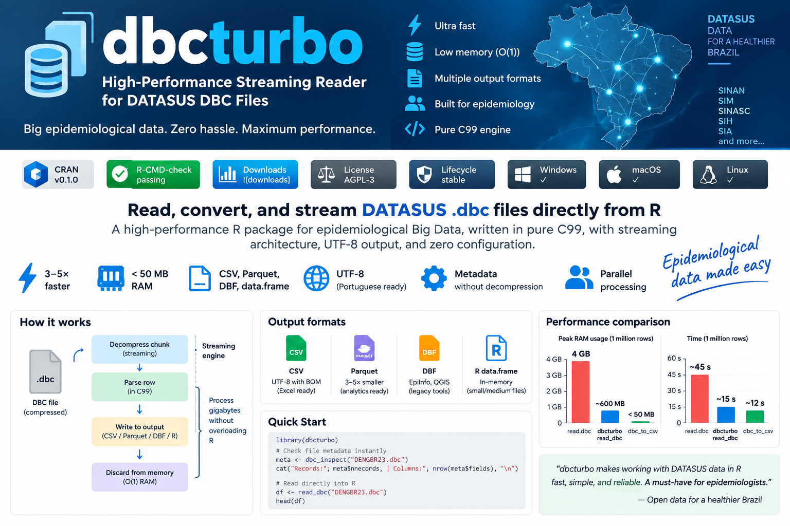

<p align="center">
  
</p>

<!-- badges: start -->
[](https://CRAN.R-project.org/package=dbcturbo)
[](https://github.com/GPimentel14/dbcturbo)
[](https://opensource.org/licenses/AGPL-3.0)
[](https://github.com/GPimentel14/dbcturbo)
[](https://lifecycle.r-lib.org/articles/stages.html)
<!-- badges: end -->

**dbcturbo** is an R package to inspect, read, and convert DATASUS `.dbc` files, with a streaming CSV/DBF conversion path and UTF-8 CSV output.

The C99 engine processes DBC input in bounded batches when writing CSV or DBF. `read_dbc()` intentionally materializes a data frame in memory, and `dbc_to_parquet()` uses a temporary CSV before conversion with Arrow.

---

## ⚡ Why dbcturbo?

- **Reads files with millions of records:** Process complete national databases (1.6M+ rows) in seconds.
- **Streaming architecture:** True chunk-by-chunk decompress and write cycle — peak RAM never grows with file size.
- **Bounded conversion memory:** CSV/DBF conversion uses a configurable record batch.
- **Clean UTF-8 output:** Automatic CP850/Latin1 transcoding with UTF-8 BOM — Portuguese characters (`ã`, `ç`, `é`) render perfectly in Excel.
- **Parquet conversion:** Converts through a temporary CSV using `arrow`.
- **Thread-safe conversion engine:** No global mutable C state; callers control any parallelism.
- **Pure C99 & cross-platform:** Zero external C library dependencies — compiles out of the box on Linux, macOS, and Windows.

---

## 🥊 Feature Comparison

| Feature | `dbcturbo` | `read.dbc` |
|:---|:---:|:---:|
| **Streaming conversion in batches** | ✅ | ❌ |
| **Clean UTF-8 output with BOM** | ✅ | ❌ |
| **Parquet conversion via Arrow** | ✅ | ❌ |
| **Direct CSV export** | ✅ | ❌ |
| **Inspect metadata without decompressing** | ✅ | ❌ |
| **Directory batch conversion** | ✅ | ❌ |
| **Thread-safe C99 engine** | ✅ | ❌ |
| **Bounded-memory CSV/DBF conversion** | ✅ | ❌ |

---

## ⚙️ How the Streaming Engine Works

Unlike traditional readers that load the entire compressed and uncompressed DBF payload into RAM simultaneously, `dbcturbo` processes records iteratively:

```text
       ┌──────────────┐
       │   .dbc File  │  Compressed DATASUS database
       └──────┬───────┘
              │
              ▼
   ┌──────────────────────┐
   │ blast() Decompressor │  64 KB chunk decompression
   └──────────┬───────────┘
              │
              ▼
   ┌──────────────────────┐
   │  C99 Parsing Engine  │  Parse row + transcode encoding to UTF-8
   └──────────┬───────────┘
              │
              ▼
   ┌──────────────────────┐
   │ Stream Write to Disk │  Write batch to CSV / DBF
   └──────────┬───────────┘
              │
              ▼
   ┌──────────────────────┐
   │   Discard from RAM   │  Bounded memory for CSV / DBF conversion
   └──────────────────────┘
```

---

## 📊 Performance

Performance depends on the file, encoding, storage device, batch size, and
hardware. On a local Ubuntu test, converting `DENGBR23.dbc` (1,645,956 rows,
121 fields) to CSV completed in 7.78 seconds. Re-run benchmarks on the target
machine before relying on a throughput estimate.

---

## ⚡ Quick Start

```r
library(dbcturbo)

# Check file metadata instantly (no decompression needed)
meta <- dbc_inspect("DENGBR23.dbc")
cat("Records:", meta$nrecords, "| Columns:", nrow(meta$fields), "\n")
#> Records: 1,645,956 | Columns: 121

# Read directly into R (small to medium files)
df <- read_dbc("DENGBR23.dbc")
head(df)
```

For large files, install the optional `data.table` package. `read_dbc()` will
use it automatically, or request it explicitly with
`engine = "data.table"`; use `engine = "base"` to force R's built-in reader.

```r
install.packages("data.table")
df <- read_dbc("DENGBR23.dbc", engine = "data.table")
```

---

## 📦 Installation

```r
# From CRAN (stable)
install.packages("dbcturbo")

# From GitHub (development)
remotes::install_github("GPimentel14/dbcturbo")
```

> **Requirements:** A standard C compiler is needed to build from source — Rtools on Windows, or GCC/Clang on Linux/macOS. CRAN binaries require no compiler.

---

## 🔧 Output Formats

Choose the format that best fits your workflow:

### 1. 📊 In-Memory Data Frame (small to medium files)

```r
library(dbcturbo)
df <- read_dbc("DENGBR23.dbc")
head(df)
```

### 2. 📄 CSV — Universal, UTF-8 encoded

Outputs a clean UTF-8 CSV with BOM — Portuguese characters (ã, ç, é) display correctly in Excel without configuration.

```r
library(dbcturbo)
# Select fields in the C writer to reduce output size and downstream work
dbc_to_csv(
  "DENGBR23.dbc", "dengue_2023.csv",
  cols = c("DT_NOTIFIC", "SG_UF_NOT", "NU_IDADE_N"),
  verbose = TRUE
)
```

### 3. 🗜️ Parquet — Conversion through a temporary CSV

Parquet is columnar and convenient to query with R (`arrow`), Python (`pandas`, `polars`), Power BI, and DuckDB. The conversion first creates a temporary CSV, so ensure enough temporary disk space is available.

```r
library(dbcturbo)
dbc_to_parquet("DENGBR23.dbc", "dengue_2023.parquet")
```

> ⚠️ **Always use `.parquet` as the output extension.** Passing a `.csv` path to `dbc_to_parquet()` will raise an informative error.

### 4. 🗂️ DBF — Legacy compatibility

For EpiInfo, QGIS, and other tools that read dBase format.

```r
library(dbcturbo)
dbc2dbf("DENGBR23.dbc", "dengue_2023.dbf")
```

### 5. 🔍 Metadata Inspection (Header-only, no decompression)

```r
library(dbcturbo)
meta <- dbc_inspect("DENGBR23.dbc")
print(meta$nrecords)   # total records
print(meta$fields)     # field names, types, widths, decimals
```

---

## ⚠️ Excel Row Limit

Microsoft Excel supports a maximum of **1,048,576 rows**.  
Many national DATASUS files (e.g., Dengue, SINASC) exceed this limit.

**Solution — filter in R before exporting:**

```r
library(dbcturbo)

df <- read_dbc("DENGBR23.dbc")

# Filter to one state (two-digit IBGE code)
df_rs <- df[df$SG_UF_NOT == "43", ]   # Rio Grande do Sul
df_sp <- df[df$SG_UF_NOT == "35", ]   # São Paulo

# Now it fits in Excel
write.csv(df_rs, "dengue_2023_RS.csv", row.names = FALSE)
```

Common state codes: `"35"` SP · `"33"` RJ · `"43"` RS · `"41"` PR · `"29"` BA · `"13"` AM

---

## 🔬 Practical Epidemiology Examples

### Decode DATASUS age encoding (`NU_IDADE_N`)

```r
decode_age <- function(x) {
  x <- as.integer(x)
  unit  <- x %/% 1000
  value <- x %%  1000
  ifelse(unit == 4, value,
  ifelse(unit == 3, value / 12,
  ifelse(unit == 2, value / 365,
  ifelse(unit == 1, value / 8760, NA_real_))))
}
df$age_years <- decode_age(df$NU_IDADE_N)
```

### Calculate notification delays

```r
# read_dbc() already returns DBF date fields as Date by default
df$delay_days <- as.numeric(df$DT_NOTIFIC - df$DT_SIN_PRI)
```

### Convert a directory of DBC files

```r
result <- dbc_batch_to_csv(
  input_dir  = "dbc/2023/",
  output_dir = "csv/2023/",
  recursive  = TRUE
)
```

### Parallel conversion

`parallel::mclapply()` uses multiple processes on macOS and Linux. On Windows,
use `dbc_batch_to_csv()` sequentially or a Windows-compatible parallel backend.

```r
library(parallel)
files <- list.files("datasus/", pattern = "\\.dbc$", full.names = TRUE)
mclapply(files, function(f) {
  dbc_to_csv(f, sub("\\.dbc$", ".csv", f))
}, mc.cores = 4L)
```

### DuckDB SQL on Parquet (zero RAM overhead)

```r
library(duckdb)
con <- dbConnect(duckdb())
dbGetQuery(con, "
  SELECT SG_UF_NOT, COUNT(*) AS cases
  FROM 'dengue_2023.parquet'
  GROUP BY SG_UF_NOT ORDER BY cases DESC
")
dbDisconnect(con)
```

---

## 📚 Documentation

- Full vignette: `vignette("introduction", package = "dbcturbo")`
- Function reference: `?dbc_to_csv`, `?dbc_to_parquet`, `?read_dbc`, `?dbc_inspect`

---

## 📖 Citation

If you use `dbcturbo` in your research or institutional pipelines, please cite it:

```bibtex
@Manual{,
  title  = {dbcturbo: High-Performance Streaming Reader for DATASUS DBC Files},
  author = {Gumercindo {Pimentel Peralta} and Juliana {da Silva}},
  year   = {2026},
  note   = {R package version 0.1.0},
  url    = {https://github.com/GPimentel14/dbcturbo},
}
```
